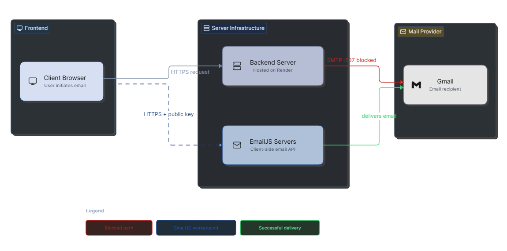

I wanted the contact form in my portfolio to feel invisible: type a message, hit send, and move on. In local development, the backend SMTP route worked fine. The problem showed up after deployment, where email delivery depended on server configuration, environment setup, and the kind of network reliability that always seems to fail at the worst time.

The issue was not with the form itself. It was with the delivery path.

## Why the backend approach was brittle

Using `Nodemailer` is a great default when you control the server. It gives you full ownership of the mail flow, clear logging, and a single place to validate submissions. But once the app is deployed on a platform like `Render`, that simplicity starts to depend on a handful of moving parts:

- SMTP credentials must be correct.
- App passwords and provider settings must be valid.
- The backend has to stay awake and reachable.
- The mail provider has to accept the message from the host.

For a portfolio contact form, that is more operational weight than the feature deserves.

## Why EmailJS fit better here

`EmailJS` let me keep the experience inside the front-end. The message is still sent to email, but the delivery now happens without a custom API round-trip through my own backend. That made the deployment simpler and reduced the number of places where a tiny config mismatch could break the flow.

The tradeoff is straightforward: you give up some backend control in exchange for a lighter, faster, easier-to-maintain setup. For a personal site, that tradeoff makes sense.

## What changed in the app

The contact page now checks whether the `EmailJS` environment variables are present. If they are, the form sends through `EmailJS` directly. If they are not, the backend route is still available as a fallback.

That keeps the site flexible while avoiding a hard dependency on SMTP for the common case.

```ts
// Check if EmailJS keys are available, otherwise fall back to the local backend API.
const handleSubmit = async (data: {
  name: string;
  email: string;
  subject: string;
  message: string;
}) => {
  try {
    if (Boolean(import.meta.env.VITE_EMAILJS_PUBLIC_KEY)) {
      // Direct front-end transport.
      await emailjs.send("service_id", "template_id", data, "public_key");
    } else {
      // Legacy backend fallback.
      await fetch("/api/contact", {
        method: "POST",
        headers: { "Content-Type": "application/json" },
        body: JSON.stringify(data),
      });
    }
  } catch (error) {
    console.error("Failed to send contact message", error);
  }
};
```

That small check is what decides the runtime path.

## Architecture flow

The diagram below shows why the `EmailJS` path is simpler. The `Nodemailer` route pushes traffic through your server, while the `EmailJS` route removes that extra hop and keeps the browser-to-email path shorter.



## The bigger lesson

Not every feature needs the most powerful architecture. For a portfolio, the best solution is usually the one that is easiest to deploy, easiest to reason about, and least likely to fail when a recruiter opens the page.

If a feature can live as local markdown, static front-end code, or a simple third-party service, that is usually the right place to start.